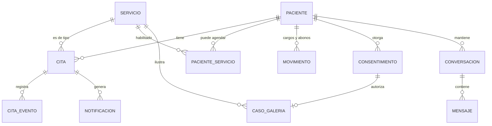

# Propuesta técnica y funcional — Plataforma Fabio Tobón Odontología

Estado: **borrador para aprobación** · 2026-10-07 · Responde al brief en `docs/brief.md`.

Convenciones: **DPF** = decisión pendiente de Fabio. **DPA** = decisión pendiente de Altreon (Esteban/Camilo). Lo marcado *(por verificar)* no está confirmado con fuente primaria.

---

## 0. Objeciones al brief antes de la arquitectura

Estas seis cosas cambian el alcance o el orden. Conviene resolverlas antes de aprobar el resto.

1. **Esto no es una landing: es un software de gestión de consultorio con historia clínica.** La historia clínica es el módulo con más riesgo legal y menos valor diferencial. Recomendación: sacarla del MVP y decidir después entre construir, integrar un software existente o dejar la que Fabio ya use (§15, §17).
2. **El orden de fases del brief entrega valor tarde.** Un CRM sin agenda (fase 2 del brief) no le sirve a Fabio para nada. Y dejar "seguridad y pruebas" como fase final es incompatible con datos de salud: van desde la primera tabla. Propuesta alternativa en §17.
3. **"Identificar al paciente existente" en un sitio público es una fuga de datos si se hace por documento.** Si alguien digita una cédula y el sistema responde distinto, cualquiera puede averiguar quién es paciente de Fabio. Tiene que ser por OTP al WhatsApp y con respuesta uniforme (§7).
4. **El número de WhatsApp es la dependencia más lenta y la menos controlada.** Conectar el número a la API cambia cómo Fabio usa WhatsApp en su celular y exige verificación del negocio ante Meta. Hay que arrancar ese trámite en la fase 0, no en la 6 (§12).
5. **"Sin secretaria" no significa sin humano.** Cada vez que el agente no sabe, escala a Fabio, que está con un paciente en la silla. Sin una bandeja de atención y reglas de escalamiento, Fabio pasa a ser su propia secretaria con más pasos. El agente necesita pausa por conversación y un canal para que Fabio responda (§12).
6. **Aparece "estado de pago" pero no hay módulo de pagos.** O es un registro manual de cargos y abonos, o es facturación (DIAN, RIPS), que es otro proyecto. Se asume lo primero y se deja fuera lo segundo (§11).

---

## 0.1 Contraste con las propuestas comerciales ya entregadas a Fabio

Documentos: `Propuesta-Fabio-Tobon-Final.pdf` (v3.0, junio de 2026, planes Esencial y Profesional) y `Propuesta-Dr-Fabio-Tobon.pdf` (12 páginas, seis piezas). El brief y lo vendido no dicen lo mismo. **Lo vendido manda sobre el brief** salvo que se renegocie, así que cada diferencia necesita una decisión.

| Tema | Lo que se le dijo a Fabio | Lo que dice el brief | Consecuencia |
|---|---|---|---|
| **Historia clínica** | No aparece en ninguna de las dos propuestas (solo "historial" y "notas clínicas" dentro del CRM) | Módulo propio del panel | Es alcance agregado después de vender. Refuerza sacarla. Ojo: "notas clínicas" ya es, en la práctica, historia clínica; hay que decidir si el CRM guarda solo notas administrativas |
| **El bot agenda en el chat** | v3.0: "agenda, reprograma y cancela", con ejemplos donde confirma y cancela citas dentro de la conversación. La de 12 páginas: solo envía el enlace | Solo entrega el enlace | Contradicción entre las dos propuestas. El enlace es la versión segura; agendar en el chat es una segunda etapa |
| **El bot recomienda y aconseja** | v3.0: "recomienda tratamientos según el caso"; ejemplos con "un implante es justo la solución" y "evita alimentos muy fríos" | Jamás diagnósticos ni tratamientos | Se construye según el brief. Esos ejemplos no pueden usarse como material de entrenamiento |
| **Reactivación proactiva** | v3.0: el bot escribe a los 15 días a quien cotizó | No se menciona | Es mensaje de marketing iniciado por el negocio: plantilla paga, requiere autorización previa del paciente y un módulo de cotizaciones. Solo si se vendió el Plan Profesional |
| **Pagos** | Plan Profesional: pasarela (Wompi) y anticipo para reservar | "Estado de pago" sin módulo | Si se vendió Profesional, el anticipo entra al flujo de reserva (§7) y deja de ser DPF |
| **Multiusuario, varios doctores** | Plan Profesional | Un solo odontólogo | Si se vendió, `profesional_id` entra al modelo desde el inicio |
| **Google Calendar** | Plan Profesional | No se menciona | Si se vendió: sincronización en una sola dirección (sistema → Google) |
| **Cotizaciones, segmentación, reportes de conversión** | Plan Profesional | No se mencionan | Módulos enteros que el brief no contempla |
| **Recordatorios** | 24 h + 30 min (12 páginas); "2 h antes" (v3.0); al doctor: resumen del día y aviso de conversación nueva | 24 h + 1 h | Configurable, pero hay que fijar el valor inicial con Fabio |
| **Stack** | Next.js, Node.js, PostgreSQL, Claude (Haiku), OpenAI de respaldo, n8n, Twilio, Wompi; VPS en Railway o DigitalOcean | Abierto | Ver §2, ya ajustado |
| **Costo operativo** | $44.000–$325.000 COP al mes, promedio $142.000 | — | Es un compromiso implícito con el cliente. Condiciona el hosting (§2) y hay que recalcular WhatsApp con las tarifas vigentes |
| **Plazo** | 6 a 7 semanas | Siete fases sin fechas | Con el alcance del Plan Profesional no es realista. Con el corte de MVP de §17 es ajustado pero defendible, si Meta y el contenido no se atrasan |
| **"Escala a múltiples clínicas sin reescribir nada"** | Prometido como ventaja | — | Es visión comercial, no requisito. No se construye multi-tenant ahora |
| **Cifras y datos de ejemplo** | "+15 años", "+3.000 pacientes", "4.9", valoración gratis, 12 cuotas, rangos de precio | — | Son de maqueta. Ninguna entra a la landing ni al agente sin que Fabio la confirme |
| **Quién firma** | Esteban González Cardona, a título personal | — | Define quién es el encargado del tratamiento de datos y quién responde. **DPA** |

**Pregunta que desbloquea todo: ¿qué plan aceptó Fabio y a qué precio?** De eso depende si pagos, cotizaciones, reactivación, multiusuario y Google Calendar están dentro o fuera.

---

## 1. Arquitectura propuesta

**Monolito modular, un solo desplegable, una sola base de datos.**

```
                    ┌──────────────────────────────────────────────┐
 Visitante ───────► │  Sitio público (landing + reserva)           │
 Fabio ───────────► │  Panel privado (/admin)                      │   Next.js
 Meta (webhook) ──► │  API interna: /api/whatsapp, /api/cron       │   (una app)
                    ├──────────────────────────────────────────────┤
                    │  Módulos de dominio (lógica de negocio)      │
                    │  agenda · pacientes · servicios · notificac. │
                    │  galería · agente · auditoría                │
                    └───────────────┬──────────────────────────────┘
                                    │
              ┌─────────────────────┼─────────────────────┐
              ▼                     ▼                     ▼
        PostgreSQL            Almacenamiento         Servicios externos
   (fuente única de verdad)   (imágenes)        WhatsApp · correo · LLM
```

Principios:

- **Una sola entidad `cita`.** Landing, panel y WhatsApp llaman a la misma función de dominio `agenda.crearCita()`. No hay tres caminos de escritura.
- **La base de datos garantiza las reglas críticas**, no el código de la interfaz: el no-solapamiento de citas es una restricción de Postgres (§10).
- **El sitio público nunca habla directo con la base de datos.** Solo a través de funciones de servidor que exponen lo mínimo (disponibilidad sí, motivos de bloqueo no).
- **Sin microservicios, sin colas externas, sin multi-tenant.** Un odontólogo, una agenda. Si aparece un segundo cliente con la misma necesidad, se evalúa la productización con evidencia.

## 2. Stack recomendado

| Capa | Elección | Por qué | Alternativa descartada |
|---|---|---|---|
| Aplicación | Next.js (App Router) + TypeScript | Landing con SEO, panel y webhooks en un solo proyecto y un solo despliegue | Astro para la landing + API aparte: dos desplegables para un equipo de dos personas |
| Base de datos | PostgreSQL gestionado | Restricciones de exclusión para la agenda y seguridad por fila | Firebase: sin relaciones ni restricciones, la agenda quedaría protegida solo por código |
| Autenticación | Librería mantenida (Supabase Auth en la opción A, Better Auth o similar en la B), con segundo factor | Evita escribir login propio sobre datos de salud | Autenticación hecha a mano |
| UI | Tailwind + componentes propios sobre primitivas accesibles | Control del diseño "no plantilla" que pide el brief | Plantilla de clínica dental |
| Notificaciones | Tabla outbox + tarea programada cada pocos minutos | Recordatorios fiables y reintentos sin infraestructura adicional | Cola externa (BullMQ, SQS): sobreingeniería para este volumen |
| WhatsApp | Twilio (API de WhatsApp Business) | Ya comunicado a Fabio y presupuestado; puesta en marcha más simple | Cloud API directo de Meta: sin recargo por mensaje, más trabajo de integración. Se puede migrar después porque queda detrás de una interfaz propia |
| Correo | Proveedor transaccional (Resend o similar) | Respaldo cuando WhatsApp falla | — |
| Agente | Claude vía API con uso de herramientas | El agente consulta datos reales en vez de "recordarlos" | Bot de menús (el brief lo descarta) |
| Hosting | **DPA** — ver abajo | | |

**Hosting: dos opciones, con efecto en el costo prometido.**

- **A. Vercel + Supabase.** Menos operación y autenticación resuelta. Los planes de producción de ambos suman del orden de 45 USD al mes *(tarifas por verificar)*, lo que por sí solo ya supera el promedio total de $142.000 COP que se le mostró a Fabio, sin contar WhatsApp ni el modelo.
- **B. Railway (aplicación + PostgreSQL).** Es lo que dice la propuesta comercial y cabe en el costo prometido. A cambio, la autenticación y el almacenamiento de imágenes se resuelven con librerías y un bucket aparte.

Recomendación: **B**, porque respeta lo vendido y el modelo de datos no cambia. La arquitectura es la misma en ambas.

**Piezas de la propuesta comercial que recomiendo no usar:**

- **n8n.** Pone reglas de negocio (recordatorios, reactivación) en un segundo lugar, fuera del repositorio, sin pruebas ni control de versiones, y es otro servicio que mantener y asegurar con datos de pacientes. El outbox con tarea programada cubre lo mismo dentro del código.
- **OpenAI como respaldo.** Dos modelos significan dos comportamientos que probar frente a pacientes. Si el modelo principal falla, el respaldo correcto es un mensaje fijo y el aviso a Fabio.

Ninguno de los dos es visible para Fabio; quitarlos no cambia lo que se le prometió.

Riesgo del stack: **la región de datos**. Cualquiera de las opciones aloja fuera de Colombia. Con datos de salud eso es transferencia internacional de datos sensibles y hay que cubrirlo en la autorización del paciente y en el contrato *(por verificar con abogado)*.

## 3. Estructura del proyecto

```
fabiotobon/
├─ CLAUDE.md                  # se redacta al aprobar esta propuesta
├─ docs/                      # brief, propuesta, decisiones (ADR)
├─ public/brand/              # logos SVG
├─ db/migrations/             # esquema versionado en SQL
└─ src/
   ├─ app/
   │  ├─ (public)/            # home, servicios, contacto, reservar
   │  ├─ (admin)/admin/       # dashboard, agenda, pacientes, servicios, config
   │  └─ api/                 # whatsapp/webhook, cron/notificaciones
   ├─ modules/                # dominio: sin dependencias de UI
   │  ├─ agenda/              # disponibilidad, citas, bloqueos
   │  ├─ pacientes/
   │  ├─ servicios/
   │  ├─ notificaciones/
   │  ├─ galeria/
   │  ├─ agente/
   │  └─ auditoria/
   ├─ components/             # UI compartida
   └─ lib/                    # clientes de BD, WhatsApp, correo, LLM
```

Regla: `app/` no contiene reglas de negocio; `modules/` no importa nada de `app/`.

## 4–6. Modelo de datos inicial, entidades y relaciones



| Entidad | Campos clave | Notas |
|---|---|---|
| `usuario` | rol, correo, segundo factor | Solo personal. Los pacientes no tienen cuenta |
| `paciente` | nombre, tipo y número de documento, teléfono (E.164), correo, nacimiento, estado, notas | El teléfono verificado es la llave de identidad pública |
| `servicio` | nombre, descripción, duración (min), precio, mostrar_precio, visible_en_landing, política de reserva, activo, imágenes | Política: `publico` (solo valoración), `pacientes`, `solo_admin`. Desactivar, nunca borrar |
| `paciente_servicio` | paciente, servicio | Qué puede autoagendar un paciente existente. **DPF**: ¿se habilita por paciente o por regla general? |
| `horario_laboral` | día de semana, inicio, fin | Varios tramos por día |
| `bloqueo` | inicio, fin, motivo (privado), día completo | El motivo nunca sale del panel |
| `cita` | paciente, servicio, inicio, fin, estado, origen (web/panel/whatsapp), token de gestión | Estados: pendiente, confirmada, cancelada, cumplida, no asistió |
| `cita_evento` | cita, tipo, antes/después, actor, fecha | Historial de creación, reprogramación y cancelación |
| `notificacion` | cita, destinatario, canal, plantilla, programada_para, estado, intentos | Outbox |
| `movimiento` | paciente, tipo (cargo/abono), valor, concepto, fecha | Saldo = suma. Sin facturación |
| `consentimiento` | paciente, tipo, texto aceptado, fecha, evidencia | Tratamiento de datos, uso de imágenes |
| `caso_galeria` | servicio, imagen antes, imagen después, consentimiento, publicado | No se publica sin consentimiento vinculado |
| `conversacion` / `mensaje` | teléfono, paciente (si se identifica), bot pausado, contenido, id de WhatsApp | Id de WhatsApp único para idempotencia |
| `conocimiento` | pregunta, respuesta autorizada, activo | Única fuente del agente junto con `servicio` |
| `auditoria` | actor, acción, entidad, fecha | Incluye lecturas de datos sensibles |
| `configuracion` | antelación mínima, horizonte, granularidad, política de cancelación | Reglas de negocio editables |

No se modela `profesional_id` ni `sede_id`. Agregar la columna después es una migración trivial; diseñarlo ahora sería abstraer sin evidencia. **DPF**: ¿hay o habrá pronto otra silla, higienista o sede?

`historia_clinica` queda fuera del esquema inicial a propósito (§15).

## 7. Flujo de reserva

1. El visitante entra a **Reservar** e ingresa su número de WhatsApp.
2. El sistema envía un código (OTP) y **siempre responde lo mismo**, exista o no el paciente.
3. Tras verificar: si el teléfono corresponde a un paciente, ve sus servicios habilitados; si no, solo **Valoración odontológica**.
4. Elige servicio → el sistema calcula los cupos (§10) → elige cupo.
5. Paciente nuevo: completa datos mínimos y acepta la autorización de tratamiento de datos.
6. `agenda.crearCita()` inserta en una transacción. Si otro tomó el cupo, la restricción de la base de datos rechaza y se le ofrecen cupos actualizados.
7. Se registran el evento y las notificaciones: confirmación a paciente y a Fabio, recordatorios a 24 h y 1 h.

Puntos abiertos:

- **DPF**: ¿la cita queda confirmada de inmediato o pendiente de aprobación de Fabio?
- **DPF**: ¿datos mínimos de un paciente nuevo? Cuanto más se pida, menos conversión.
- **DPF**: ¿se cobra o no la valoración, y se exige abono para reservar? Sin ningún freno, las inasistencias son el riesgo operativo principal de una agenda abierta.
- Un paciente antiguo que cambió de número cae como "nuevo". Se resuelve fusionando fichas desde el panel.

## 8. Flujo de cancelación

1. El paciente abre el enlace de gestión de su confirmación (token único por cita), o lo pide por WhatsApp.
2. El sistema valida la política de cancelación.
3. La cita pasa a `cancelada` (no se borra), se registra quién y cuándo, se cancelan los recordatorios pendientes.
4. Se notifica a ambas partes. El cupo queda libre automáticamente porque la restricción solo cuenta citas activas.

**DPF**: ¿hasta cuántas horas antes puede cancelar el paciente por su cuenta? ¿Qué pasa después de ese límite?

## 9. Flujo de reprogramación

La cita **se actualiza, no se duplica**: mismo registro, nuevo horario, en una sola transacción. El evento guarda el horario anterior y el nuevo. Si el nuevo cupo no está libre, la transacción falla y el horario original se conserva intacto; no existe el estado intermedio "sin cita". Los recordatorios se reprograman y la notificación muestra ambos horarios.

**DPF**: ¿límite de reprogramaciones por cita?

## 10. Arquitectura del calendario

- **Los cupos no se guardan, se calculan**: `horario_laboral − bloqueos − citas activas`, partido según la duración del servicio y la granularidad configurada. Cambiar una duración o crear un bloqueo surte efecto al instante, sin regenerar nada.
- **No-solapamiento garantizado por Postgres** con una restricción de exclusión sobre el rango de tiempo de las citas activas. Dos reservas simultáneas al mismo cupo: una gana, la otra recibe error controlado.
- **Zona horaria única** `America/Bogota`; se almacena en UTC.
- **El público ve solo "disponible / no disponible".**
- **Vacío del brief — bloqueo sobre citas existentes:** si Fabio bloquea un martes que ya tiene citas, el sistema no puede cancelarlas en silencio. Debe listar las afectadas y obligar a decidir (reprogramar o cancelar con aviso) antes de guardar el bloqueo.
- **DPF**: ¿Fabio usa hoy Google Calendar u otra agenda? Sincronizar en dos direcciones es caro y frágil. Recomendación: que este sistema sea la única agenda y, si acaso, exportar en una dirección.

## 11. Arquitectura del CRM

Tabla de pacientes con búsqueda y filtros resueltos en el servidor; ficha con pestañas: datos, agenda, estado administrativo, consentimientos y, más adelante, historia clínica.

- **Estado de pago**: derivado del saldo de `movimiento`. Registro manual de cargos y abonos. **Fuera de alcance**: facturación electrónica, RIPS, pasarela de pagos.
- **"Estado del paciente" y "estado del tratamiento"**: el brief no define los valores. **DPF**.
- **Migración inicial**: ¿dónde están hoy los pacientes (Excel, cuaderno, otro software)? Define si hace falta un importador. **DPF**.

## 12. Arquitectura del agente de WhatsApp

```
Mensaje entrante → webhook (verifica firma, descarta duplicados por id)
   → guarda mensaje → ¿bot pausado en esta conversación? → sí: solo notifica a Fabio
   → no: LLM con herramientas → respuesta → guarda → envía
```

Herramientas del agente (lo único que puede "saber"):

| Herramienta | Devuelve |
|---|---|
| `listar_servicios` / `ver_servicio` | Solo campos autorizados; precio únicamente si `mostrar_precio` |
| `buscar_conocimiento` | Respuestas aprobadas por Fabio |
| `consultar_disponibilidad` | Cupos reales calculados por el módulo de agenda |
| `enlace_de_reserva` | Enlace al flujo web (§7) |
| `mis_citas` | Solo para el número que escribe |
| `escalar_a_humano` | Pausa el bot y avisa a Fabio |

Decisiones de diseño:

- **En la primera versión el agente no crea citas: entrega el enlace**, como plantea el brief. Reduce a cero el riesgo de que agende mal y reutiliza el flujo ya probado.
- **Reglas duras fuera del modelo**: sin diagnósticos, sin promesas de resultado, sin precios que no vengan de la herramienta. Señales de urgencia (dolor intenso, sangrado, trauma) escalan siempre.
- **Notas de voz**: en Colombia son la mitad del tráfico. O se transcriben (costo y un proveedor más) o el agente pide texto. **DPA**.
- **Fotos**: los pacientes mandarán fotos de su boca. Es dato de salud entrando por WhatsApp; el agente no las interpreta y las deriva a valoración.
- **Dónde responde Fabio cuando hay escalamiento.** Con el número conectado a la API hay dos caminos: una bandeja en el panel (hay que construirla) o la modalidad de coexistencia, que permite seguir usando la app WhatsApp Business en el mismo número *(disponibilidad y límites por verificar en la documentación de Meta)*. **DPA + DPF**.
- **Número**: ¿el actual de Fabio o uno nuevo? El actual conserva a los pacientes pero mezcla sus chats personales con el bot. **DPF**.

Costo: el cobro es por mensaje entregado. Según una fuente de proveedor *(por verificar con la tabla oficial de Meta para Colombia)*, desde el 1 de octubre de 2026 los mensajes de servicio dejan de ser ilimitados (1.000 gratis al mes por número y luego se cobran) y las plantillas de utilidad se cobran también dentro de la ventana de 24 horas. Cada cita genera al menos tres plantillas al paciente (confirmación y dos recordatorios), más el OTP.

## 13. Sistema de notificaciones

- **Outbox**: al crear, mover o cancelar una cita se insertan filas en `notificacion` dentro de la misma transacción. Una tarea programada envía las vencidas, con reintentos y registro de fallos.
- **Canales**: WhatsApp (plantillas preaprobadas por Meta) como principal; correo como respaldo.
- **Recordatorio de 1 hora**: con un ciclo de cinco minutos el desfase es aceptable. No hace falta precisión al segundo.
- **Antes de enviar se revalida**: si la cita se canceló o se movió, el recordatorio no sale.
- **A Fabio**: **DPF** — ¿WhatsApp a su número personal, correo o solo el panel? Un recordatorio una hora antes de cada cita son muchos mensajes al día para alguien que ya tiene la agenda abierta.
- Las plantillas requieren aprobación de Meta: el texto se define temprano y cambiarlo no es inmediato.

## 14. Seguridad y roles

| Rol | Acceso |
|---|---|
| `admin` (Fabio) | Todo |
| `asistente` (futuro) | Agenda y datos administrativos, sin historia clínica. Solo si se contrata a alguien |
| Paciente | Sin cuenta. Sesión corta por OTP, limitada a sus propias citas |
| Altreon (soporte) | **DPA**: acceso a producción bajo qué condiciones y con qué registro |

- RLS con negación por defecto; el sitio público solo usa funciones de servidor.
- Segundo factor obligatorio en el panel.
- Auditoría de escrituras y de lecturas de datos sensibles.
- Límite de intentos en OTP y en reservas; verificación de firma en webhooks.
- Imágenes en almacenamiento privado con URL firmadas; las de galería pública pasan por un paso explícito de publicación.
- Copias de seguridad con restauración probada, no solo configurada.
- Secretos fuera del repositorio desde el primer commit.

## 15. Riesgos técnicos y regulatorios

| Riesgo | Impacto | Mitigación |
|---|---|---|
| **Historia clínica regulada.** Conservación mínima de 15 años desde la última atención (Res. 839 de 2017). Hay un proyecto de resolución de Minsalud (julio de 2026) que derogaría las Res. 1995/1999 y 839/2017, incluye en su ámbito a los **proveedores de sistemas de información en salud** y prevé 18 meses de transición hacia sistemas interoperables. No verifiqué si ya fue expedida | Altreon podría quedar como sujeto obligado; compromiso de custodia a 15 años | Fuera del MVP. Concepto jurídico antes de construir. Evaluar integrar un software ya habilitado |
| **Datos sensibles (Ley 1581 de 2012).** Altreon sería encargado del tratamiento | Responsabilidad legal directa | Contrato de encargo, autorización expresa del paciente, política de tratamiento *(por verificar con abogado)* |
| **Fotos de antes y después.** Son datos de salud e imagen del paciente; además la publicidad odontológica está sujeta al código de ética (Ley 35 de 1989) *(artículos aplicables por verificar)* | Sanción ética a Fabio, reclamación de pacientes | Consentimiento vinculado a cada caso; revisión de textos sin promesas de resultado |
| **Dependencia de Meta**: verificación del negocio, aprobación de plantillas, cambios de precio y de política | Bloquea notificaciones y agente | Iniciar trámite en fase 0; correo como respaldo |
| **El agente afirma algo falso** | Reputacional y, si es clínico, legal | Solo herramientas, reglas duras, registro completo, pausa manual |
| **Inasistencias por agenda abierta** | Huecos en la agenda de Fabio | Verificación por OTP, recordatorios, política de abono (DPF) |
| **Costo y custodia a largo plazo** | ¿Quién paga hosting, WhatsApp y LLM dentro de tres años? ¿Qué pasa con los datos si termina el contrato? | Cuentas a nombre de Fabio, plan de salida y exportación (DPA) |
| **Contenido inexistente** | La landing se diseña sobre relleno | Pedir fotos y textos en fase 0 |

## 16. Preguntas para Fabio antes de continuar

**Negocio y contenido**
1. ¿Qué procedimientos ofrece realmente y cuáles quiere destacar?
2. ¿Qué precios se pueden mostrar o decir, y cuáles nunca?
3. ¿Tiene fotos profesionales propias y casos de antes y después con autorización escrita de los pacientes?
4. Dirección, horarios, datos de contacto, registro profesional.

**Agenda**
5. Horario real de atención y antelación mínima para reservar.
6. Duración de cada tipo de cita.
7. ¿Las citas web quedan confirmadas o las aprueba él?
8. Política de cancelación, reprogramación e inasistencia. ¿Abono para reservar?
9. ¿Usa hoy alguna agenda que haya que conservar?
10. ¿Otra silla, otro profesional u otra sede en el horizonte?

**Pacientes y datos**
11. ¿Dónde está hoy su información de pacientes y cuántos son?
12. ¿Qué estados de paciente y de tratamiento maneja?
13. ¿Cómo lleva hoy la historia clínica y con qué software? ¿Está habilitado como prestador independiente?
14. ¿Cómo registra pagos y quién le factura?

**WhatsApp**
15. ¿Usa el número actual o uno nuevo? ¿Es WhatsApp normal o Business?
16. ¿Qué preguntas le hacen con más frecuencia? (Pedirle exportar chats reales es la mejor fuente.)
17. ¿Cuándo y cómo quiere que lo interrumpan por un escalamiento?
18. ¿Cómo quiere recibir sus propias notificaciones?

**Decisiones de Altreon (no de Fabio)**
- Modelo comercial: precio del proyecto, mantenimiento mensual, quién asume los costos variables.
- Titularidad de cuentas (Meta, hosting, dominio) y del código.
- Contrato de encargo de datos y plan de salida.
- Hosting (opción A o B de §2); transcripción de notas de voz.
- Qué plan se vendió y si el plazo de 6 a 7 semanas sigue vigente.

## 17. Fases recomendadas

| Fase | Entrega | Fabio puede usarlo |
|---|---|---|
| **0. Descubrimiento** | Respuestas de §16, contenido, concepto jurídico, inicio de verificación en Meta, repo y base técnica (auth, migraciones, auditoría, CI) | — |
| **1. Landing** | Home, servicios administrados desde la base de datos, contacto, botón de WhatsApp directo (sin bot) | Sí: captación desde el día uno |
| **2. Agenda y reserva** | Panel con acceso seguro, servicios, horario, bloqueos, calendario, reserva pública de valoración, ficha mínima de paciente | Sí: núcleo del producto |
| **3. Ciclo de la cita** | Notificaciones por WhatsApp y correo, cancelación y reprogramación por enlace | Sí |
| **4. CRM** | Ficha completa, reserva de pacientes existentes, cargos y abonos, galería de antes y después administrable | Sí |
| **5. Agente** | Agente de WhatsApp con herramientas, escalamiento y bandeja o coexistencia | Sí |
| **6. Historia clínica** | Solo tras el concepto jurídico: construir, integrar o descartar | Condicional |

Cambios frente al brief: agenda antes que CRM completo; seguridad y pruebas dentro de cada fase; historia clínica al final y condicionada; fase 0 explícita porque Meta y lo legal tienen tiempos que no controlamos.

**Corte de MVP sugerido: fases 0 a 3.** Con eso Fabio capta, agenda y recuerda citas sin secretaria. El agente y el CRM completo se construyen ya con datos reales de uso.

---

## Fuentes

- [Resolución 839 de 2017 — tiempos de conservación (Consultorsalud)](https://consultorsalud.com/?p=18372)
- [Texto de la Resolución 839 de 2017 (Secretaría de Salud de Bogotá)](https://www.saludcapital.gov.co/DDS/Documentos_I/Res_839_2017.pdf)
- [Minsalud — memoria justificativa del proyecto de resolución de historia clínica, 22 de julio de 2026](https://www.minsalud.gov.co/Normativa/anexosproyectos/ANEXO2MEMJUSTIFICATIVAHISTORIA%20CLINICA%2022%20JUL%2026_20260722151201.pdf)
- [Minsalud — normatividad de interoperabilidad de historia clínica electrónica](https://www.minsalud.gov.co/ihce/Paginas/Normatividad.aspx)
- [Precios de la API de WhatsApp Business (Visito, fuente de proveedor)](https://www.visitoai.com/en/blog/whatsapp-business-api-pricing)
- [Ley 35 de 1989 — ética del odontólogo colombiano](https://www.dmsjuridica.com/buscador_20179478954/legislacion/leyes/2024/02/06/ley-35-de-1989/?pdf=4847)

Esta propuesta no reemplaza un concepto jurídico; los puntos regulatorios requieren revisión de un abogado antes de construir sobre ellos.

---

## Anexo 2026-10-08 · WhatsApp: número y coexistencia (para la fase 5)

- Número actual: +57 323 345 6845. Hoy Fabio lo usa como personal y del consultorio; va a separarse (fecha pendiente).
- Requisito de Esteban: Fabio debe poder seguir respondiendo desde ese número aunque el agente esté activo. Esto exige **coexistencia** (app WhatsApp Business + API en el mismo número).
- Condiciones conocidas de la coexistencia (por verificar al implementar): el número debe estar en **WhatsApp Business** (no WhatsApp normal); la app debe abrirse al menos cada 13 días; se pierden grupos sincronizados, mensajes temporales, "ver una vez", copias de seguridad y listas de difusión; las respuestas que Fabio envía desde la app llegan a la API como eventos de eco (`smb_message_echoes`).
- **Twilio no está confirmado** como proveedor con coexistencia. Sí la documentan 360dialog, Infobip, Telnyx y respond.io. Verificar con Twilio antes de la fase 5; si no la soporta, la elección de proveedor se reabre (DPA).
- Reglas del agente derivadas:
  - Cuando llega un eco (Fabio respondió desde la app), el agente se pausa en esa conversación por un tiempo configurable; el panel permite reanudarlo.
  - Mientras el número sea también personal, **todas** sus conversaciones llegarían al sistema: hace falta una lista de contactos que el agente ignora y cuyos mensajes no se guardan. Recomendación: no activar el agente hasta separar el número.
